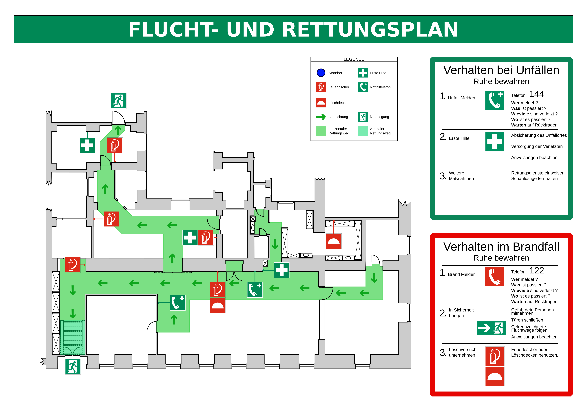

# What is it?
version control of the floor plan. Using https://metalab.at/wiki/Datei:Grundriss.svg as a base

# What can it do?

Generate images like this one:

    or this type

# Acknowledge
Using Template from https://de.wikipedia.org/wiki/Datei:FRP_Musterplan.svg (released under GPL 1.2 from Uweka and Flor!an)
