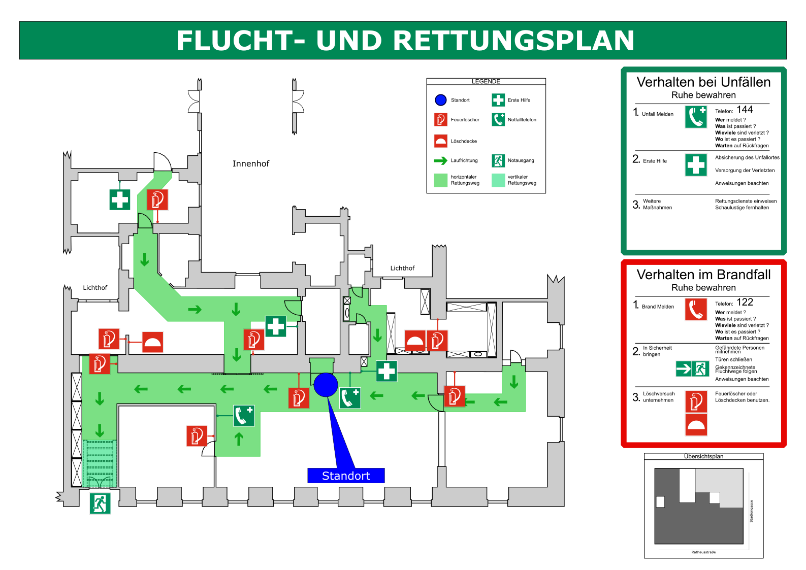

# What is it?
version control of the floor plan. Using https://metalab.at/wiki/Datei:Grundriss.svg as a base

# What can it do?

Generate images like this one:

or this type

# Acknowledgement
Using Template from https://de.wikipedia.org/wiki/Datei:FRP_Musterplan.svg (released under GPL 1.2 from Uweka and Flor!an)

# See also

* [ASR A1.3](http://www.baua.de/de/Themen-von-A-Z/Arbeitsstaetten/ASR/pdf/ASR-A1-3.pdf?__blob=publicationFile)
* DIN ISO 23601
* [Presentation about DIN ISO 23601](http://www.baua.de/de/Themen-von-A-Z/Arbeitsstaetten/Tagungen/pdf/Vortrag-Sicherheitskennzeichnung-2014-05.pdf?__blob=publicationFile&v=3)
* [Information about DIN ISO 23601](http://www.bfb-ringwald.de/fileadmin/user_upload/Downloads/bfb-ringwald-artikel-neue-DIN-ISO-23601_Flucht-und-Rettungsplaene.pdf)
* [Lagerichtigkeit von Plänen](http://www.asd-sonntag.de/Flucht-%20und%20Rettungsplan%20-%20lagerichtig%20dargestellt.pdf)
