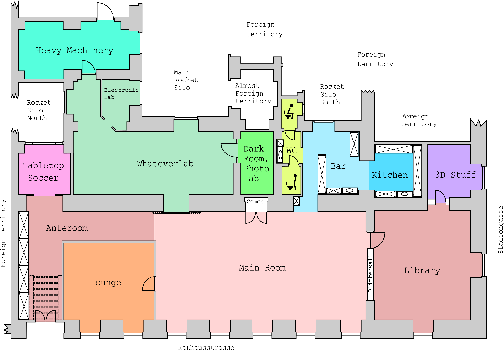

# What is it?
version control of the floor plan. Using https://metalab.at/wiki/Datei:Grundriss.svg as a base

# What can it do?

Generate images like this one:

or this type

# Acknowledgement
Using Template from https://de.wikipedia.org/wiki/Datei:FRP_Musterplan.svg (released under GPL 1.2 from Uweka and Flor!an)

# See also

* [ASR A1.3](http://www.baua.de/de/Themen-von-A-Z/Arbeitsstaetten/ASR/pdf/ASR-A1-3.pdf?__blob=publicationFile)
* DIN ISO 23601
